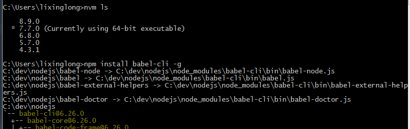
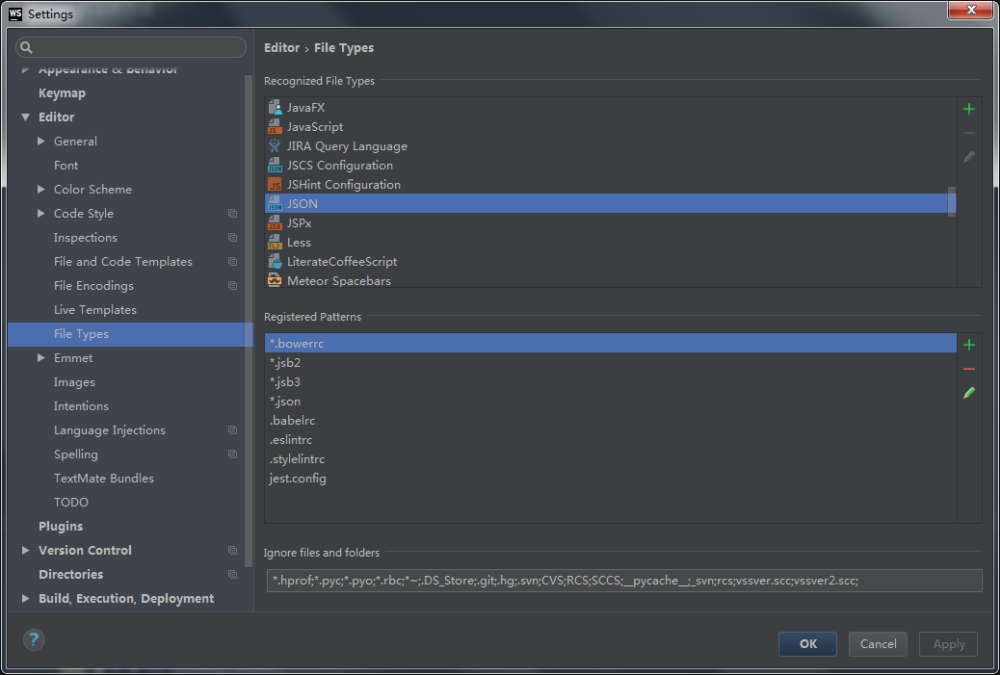

## babel下载配置

#### 一、下载安装Babel

环境：需要装node

npm install babel-cli -g把模块安装在全局环境下（在任何项目中，都可以使用命令来编译代码了）

npm unistall babel-cli -g 卸载



观看安装目录发现一些细节知识点：

1. 我们后期之所以可以使用babel命令，是因为安装在全局环境下，会生存一些xxx.cmd的文件，而这里的xxx就是可以在DOC窗口中执行的命令（如改成renee.cmd，则我可以使用renee xxx等命令）

   `babel.cmd`以后可以使用babel命令了

2. 执行babel命令后我们可以完成一些编译或者其他任务，主要原因是执行babel命令后，会自动加载一些处理任务的文件

#### 二、配置.babelrc文件，安装一些语言解析包

1. 我们需要把.babelrc文件配置在当前项目的根目录下（没有文件名，后缀即babelrc）

+ 在电脑上不能直接创建没有文件名的文件，需要使用WS或者命令来创建
+ babelrc这个后缀在某些WS不能识别，它是一个json文件，需要在WS中配置一下（让它隶属于       json文件），配置图如下

2. 在文件编写一些内容

```json
{
  "presets":[], //存放的是需要依赖的语言解析包
  "plugins":[]  //存放的是需要依赖的插件信息
}
```

3. 安装依赖的语言解析包

> 在当前的根目录安装（不是安装在全局）
>
> `npm install babel-preset-latest`安装最新已发布的语言标准解析模块
>
> 安装成功后在自己的当前根目录下，有一个`node_modules` 文件夹，在这个文件夹中有安装的模块

4、完成最后的.babelrc文件的配置

```json
{
  "presets":["latest"], 

  "plugins":[] 
}

```

#### 三、使用命令行编辑JS代码

基本所有支持命令操作的模块都有一个命令

> ` babel --help / babel -h ` 查看帮助
>
> ` babel --version / babel -v ` 查看版本号
>
> ` babel --out-file / babel -p` 把某一个JS文件中的ES6代码进行编译
>
> ` babel --out-dir / babel -d` 把某一个文件夹中所有的JS文件中的ES6代码进行编译
>
> `babel --watch / babel -w` 监听文件中代码的改变，若改变则会自动编译

