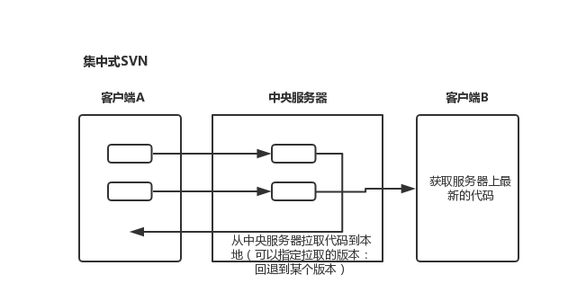
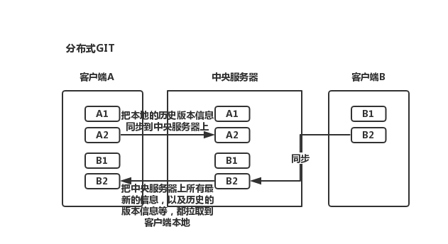
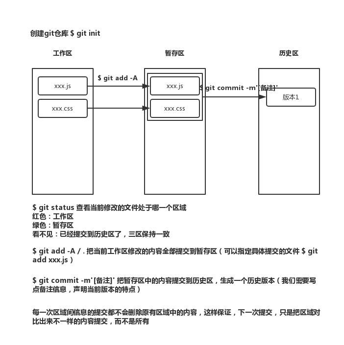

## 1.版本控制系统

开发中我们把每一次的修改都有效的进行记录（记录成一个版本），后期如果需要回退到原有的各个版本或者是用当前的和某一个版本进行比较等，都可以有效的进行管理

常用的版本控制系统：SVN(集中式)/GIT(分布式)

## 2.分布式、集中式版本管理系统的特点

### 集中式



所有的历史版本都是在中央服务器上建立的，本地客户端只是一个开发的环境，开发完需要推到服务器上生成历史版本，需要回退到某个版本，也需要从中央服务器拉取，必须连接上中央服务器才可以（必须联网）

### 分布式



所谓分布式，就是每个开发者的本地客户端都是一个完整的仓库，都能记录历史版本信息，这样不需要联网，我们也能生成版本记录，也可以快速回退到每个版本

Linux团队开发的git，所以git中的命令大部分都是linux命令

GIT是按照源数据（文件流）来实现文件传输的，而SVN是按照文件传输的。所以GIT比SVN更快。

## LINUX命令

后期我们更多的都是基于命令来完成git管理的，所以要学一些简单的LINUX命令。

window操作系统：DOS窗口和DOS命令

LINUX服务器操作系统：LINUX命令 （MAC的终端使用的也是LINUX命令）

```
ls -l/-a:ls查看当前目录结构（-a是可以看见所有的，包含隐藏的）
cd xxx[路径地址]:进入到执行的文件夹中（进入的路径地址，可以粘贴到对应的操作命令窗口中，也可以拖进来)
	cd /:根目录
	cd ./:当前目录
	cd ../:上级目录
	
clear:清屏

mkdir:创建文件夹
touch:创建空的文件夹
vi:向文件中插入或者管理一些内容 (vi test.js)
	i=>进入到插入模式
	:WQ:保存并退出
	ESC+:WQ:退出内容的插入模式，把刚才编辑的内容进行保存
	
echo:向指定的文件中输入内容
cat:查看文件中的内容 (cat test.js)
cp:拷贝
rm:删除文件 -r递归删除 -f强制删除，一旦删除无法还原 (例如$ rm node_modules -rf,$rm *.js -rf所有.js结尾的)
```

## GIT的常规流程

1.每一个git仓库都有三个区

工作区：写代码

暂存区：临时存放每一次修改代码的地方，但是并没有生成历史版本

历史区：存放所有历史版本的地方（提交到历史区就会生成历史版本）

一些细节问题

1. 如果是第一次使用git，生成历史版本的时候，需要提供身份认证

   ```
   只需要在本地git全局幻境下配置一些信息即可
   $ git config -l
   $ git config --global user.name 'reneetsang'
   $ git config --global user.email 'reneetsang@163.com'
   ```

2. 真实项目中，并不是所有的文件都和项目有关系（例如：.idea是WS生成的配置文件夹和项目没有关系），也不是所有的文件都提交（例如：node_modules中的内容太大了，也不需要提交）

   .gitignore =>就是git提交的忽略文件，把不提交的文件写上去

   ```
   # dependencies
   /node_modules
   
   .idea
   ```

2.把暂存区的某一个文件删除（提交到暂存区的内容有问题，我们可以删除掉，这个比较少用出）

$ git rm --cached xxx.xx 把暂存区的某一个文件撤回到工作区

$ git rm --cached . -r 删除暂存区中所有提交的

$ git rm --cached xxx.xx -f 如果在撤销过程中，发现从暂存区撤销的文件在工作区已经被修改了，只有加上-f才能强制从暂存区把内容删除掉

3.代码回滚操作

提交到暂存区一份，把工作区内容改了，但是改的东西不好，想把暂存区上次提交的内容撤回到工作区（想要把暂存区的内容覆盖工作区新写的内容）

$ git checkout xxx.xx 暂存区内容没有消失，只是把工作区最新修改的信息给覆盖了，让工作区和暂存区保持一致

$ git checkout . 把暂存区内容回滚到工作区（一旦回滚，工作区内容无法恢复）

$ git reset HEAD . 把当前暂存区的内容回滚到上一个暂存区，目的是为了把上一个暂存区内容回滚到工作区。把最近暂存区中的内容删除掉，紧接着执行git checkout . 把上一个暂存区内容撤回到工作区

$ git reset --hard 版本号 在历史区中会退到某一个版本（强制把暂存区和工作区都变成回退后的版本），这个项目中比较常用。

$ history > xxx.txt 可以把历史操作步骤输出到xxx.txt文件中

4.查看每个区代码区别

$ git diff 工作区VS暂存区

$ git diff master 工作区VS历史区MASTER分支

$ git diff --cached 暂存区VS历史区

5.$ git log 查看历史版本信息

git log –pretty=oneline 显示简短的历史记录

#### 团队协作模式

- 创建客户端本地仓库（一个开发者就是一个单独的仓库），还需要本地的仓库和远程仓库保持关联，这样才可以实现后续的信息同步

  $ git init->创建本地仓库

  $ git remote add origin 远程仓库git地址 ->让本地仓库和远程仓库保持连接

  $ git remote -v ->查看连接信息（origin是链接的名称，一般都用这个名字，当然自己可以随便设置）

  $ git remote rm origin ->移除本地仓库和远程仓库的连接

  $ git remote update origin ->更新链接通道

  有更简单的方式：只要把远程仓库克隆到本地，就相当于创建本地仓库，而且自动建立了链接，并且把远程仓库中的内容也同步到本地

  $ git clone 远程仓库git地址 本地仓库文件夹的名字（不写就默认是仓库名字）

- 各自和中央服务器同步信息

  拉取：$ git pull origin master

  推送：$ git push origin master （每一次push之前最好都pull一下，如果有冲突在本地处理一下冲突，然后再推送。需要时要gitHub的用户密码来进行权限校验：一般都是组长在远程仓库中把组件的账号都放到小组中，这样组员用自己的账号也有权限操作仓库了，最后在本地的git配置中把用户名和邮箱修改为和gitHub账号相同的信息）

##### 无分支管理模式

所有人使用的都是master分支，每天上班的第一件事情，以及每天提交自己代码的时候，第一件事情就是先拉取

拉取：$ git pull origin master

推送：$ git add.

	    $ git commit -m ''
	
	        $ git push origin master 

冲突合并：

不是同一行代码冲突：在提示的冲突命令行同意即可

	ESC :wq(按下enter键即可) 然后提交

同一行冲突：尝试合并失败，我们需要手动把代码进行合并，然后重新提交

##### 单独分支管理

1. 每天第一件事把远程master内容拉取到本地master上（提交之前也是），每个人在自己本地仓库中，先进行分支创建和切换

   新创建分支时，会把本地master中的历史信息同步到新创建的分支上

   ```
   $ git branch ->查看当前存在的分支
       * master ->星代表当前在哪个分支上
   $ git branch dev ->创建一个叫做dev的分支
   $ git checkout dev ->切换到dev分支上
   $ git checkout -b dev ->创建并且切换到这个分支
   ```

2. 正常的开发和提交，但是所有的操作都是在自己的分支上

3. 把自己本地分支中的内容，合并到自己本地master分支上

   ```
   $ git stash ->暂存文件，当工作区或者暂存区还有没有提交到历史版本的信息，分支切换时候，防止信息丢失，先stash暂存文件（分支有更改，但不想生成历史版本，不能直接切换分支，需要把分支上修改的内容暂存）
   $ git checkout dev ->切换到master的分支上
   $ git stash pop ->还原暂时存储的内容
   $ git merge xxx ->把xxx分支合并到当前分支上（有冲突按照之前的规则修改）
   ```

4. 删除本地创建的分支（除非别人的分支跟你不同名，比如都叫dev会有冲突）

   - 下一次重新创建分支时候可以让分支和master同意
   - 远程仓库中不记录任何的分支信息，防止冲突

   ```
   $ git branch -D dev ->删除dev分支（删除的时候需要先切换到其他分支才可以删除）
   ```

5. 将本地master分支中的内容提交到远程仓库中


## git使用

cat readme.txt查看内容

第一步：使用命令 git add readme.txt添加到暂存区里面去
第二步：用命令 git commit告诉Git，把文件提交到仓库实际上，就是把暂存区的所有内容提交到当前分支上
git commit -m "注释"

git status 来查看下结果
git diff readme.txt 想看readme.txt文件到底改了什么内容
git log 查看下历史记录，显示从最近到最远的显示日志
git log –pretty=oneline 显示简短的历史记录
git reflog 获取到版本号，然后git reset --hard 6fcfc89（版本号）来恢复

git reset --hard HEAD^ 把当前的版本回退到上一个版本，上上一个版本就多加一个^
git reset --hard HEAD~100 回退到前100个版本
git checkout -- readme.txt 把readme.txt文件在工作区做的修改全部撤销
​	1.readme.txt自动修改后，还没有放到暂存区，使用 撤销修改就回到和版本库一模一样的状态。
​	2.另外一种是readme.txt已经放入暂存区了，接着又作了修改，撤销修改就回到添加暂存区后的状态。

git remote add origin https://github.com/tugenhua0707/testgit.git 可以从这个仓库克隆出新的仓库，也可以把一个已有的本地仓库与之关联，然后，把本地仓库的内容推送到GitHub仓库。
git push命令，实际上是把当前分支master推送到远程。
​	由于远程库是空的，我们第一次推送master分支时，加上了 –u参数，Git不但会把本地的master分支内容推送的远程新的master分支，还会把本地的master分支和远程的master分支关联起来，在以后的推送或者拉取时就可以简化命令。
​	从现在起，只要本地作了提交，就可以通过如下命令：
​	git push origin master

git clone http://.... 克隆一个本地库

git checkout -b dev 创建并切换分支，git checkout 命令加上 –b参数表示创建并切换，相当于如下2条命令
​	git branch dev 创建分支
​	git checkout dev 切换分支
​	git branch查看分支，会列出所有的分支，当前分支前面会添加一个星号。
git merge dev 把dev分支上的内容合并到当前分支上
git branch -d dev 删除dev分支
总结创建与合并分支命令如下：
查看分支：git branch
创建分支：git branch name
切换分支：git checkout name
创建+切换分支：git checkout –b name
合并某分支到当前分支：git merge name
删除分支：git branch –d name

git add -A  提交所有变化  
git add -u  提交被修改(modified)和被删除(deleted)文件，不包括新文件(new)  
git add .  提交新文件(new)和被修改(modified)文件，不包括被删除(deleted)文件  