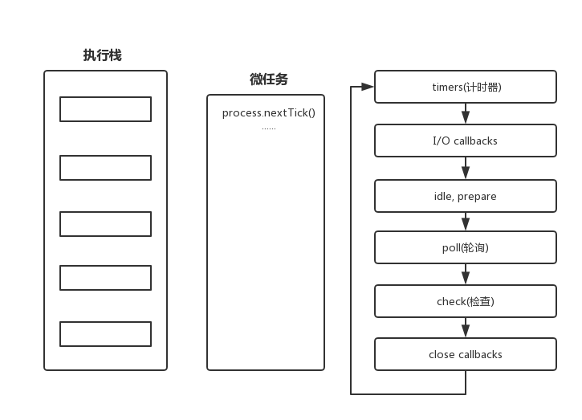

## Event loop事件循环

大家都知道，javascript是一门单线程语言，因此为了实现主线程的不阻塞，**Event Loop**这样的方案应运而生。

浏览器和node中Event loop并不一样，浏览器的[Event loop](https://link.juejin.im/?target=https%3A%2F%2Fwww.w3.org%2FTR%2Fhtml5%2Fwebappapis.html%23event-loops)是在HTML5中定义的规范，而node中则由[libuv](https://link.juejin.im/?target=http%3A%2F%2Fthlorenz.com%2Flearnuv%2Fbook%2Fhistory%2Fhistory_1.html)库实现。

### 浏览器中的Event loop

- 所有同步任务都在主线程上执行，形成一个执行栈
- 主线程之外，还存在一个任务队列。
  - 任务队列分为macro-task(宏任务)和micro-task(微任务)。
  - macro-task(宏任务): setTimeout, setInterval, setImmediate, I/O等
  - micro-task(微任务): process.nextTick, 原生Promise(有些实现的promise将then方法放到了宏任务中),Object.observe(已废弃), MutationObserver等

整个最基本的**Event Loop**如图所示：


具体过程：

1. 浏览器中，先执行当前栈，执行完主执行线程中的任务。
2. 取出Microtask微任务队列中任务执行直到清空。
3. 取出Macrotask宏任务中 **一个** 任务执行。
4. 检查Microtask微任务中有没有任务，如果有任务执行直到清空。
5. 重复3和4。

> 即为同步完成，一个宏任务，所有微任务，一个宏任务，所有微任务......整个的这种运行机制又称为Event Loop(事件循环)

#### 例子

了解浏览器的Event loop后，查看下面例子，猜测浏览器是怎么输出的

```javascript
console.log(1);
console.log(2);
setTimeout(function(){
  console.log('setTimeout1');
  Promise.resolve().then(function(){
    console.log('Promise')
  })
})
setTimeout(function(){
  console.log('setTimeout2');
})

//浏览器输出：1 2 setTimeout1 Promise setTimeout2
```

### node中的Event loop

- 在libuv内部有这样一个事件环机制。在node启动时会初始化事件环。
- node中的event loop分为6个阶段，不同于浏览器的是，这里每一个阶段都对应一个事件队列，node会在当前阶段中的全部任务执行完，清空NextTick Queue，清空Microtask Queue，再执行下一阶段。


- 在node.js里，process 对象代表node.js应用程序，可以获取应用程序的用户，运行环境等各种信息。process.nextTick()方法将 callback 添加到`next tick 队列`，并且nextTick优先级比promise等microtask高。

>1. 定时器（timers）：执行setTimeout() 和 setInterval()中到期的callback。定时器的用途是让指定的回调函数在某个阈值后会被执行，具体的执行时间并不一定是那个精确的阈值。定时器的回调会在制定的时间过后尽快得到执行，然而，操作系统的计划或者其他回调的执行可能会延迟该回调的执行。
>2. I/O callbacks：上一轮循环中有少数的I/Ocallback会被延迟到这一轮的这一阶段执行。这个阶段执行一些诸如TCP错误之类的系统操作的回调。例如，如果一个TCP socket 在尝试连接时收到了 ECONNREFUSED错误，某些 *nix 系统会等着报告这个错误。这个就会被排到本阶段的队列中。
>3. idle, prepare：队列的移动，仅内部使用
>4. poll：最为重要的阶段，执行I/O callback，在适当的条件下会阻塞在这个阶段
>5. check：执行setImmediate的callback
>6. close callbacks：执行close事件的callback，例如socket.on("close",func)



#### 例子

> 查看下面例子加深对event loop的理解

在node执行下面代码，发现每次执行先后顺序不一样，因为node需要启动时间，执行过程中setTimeout可能到时间了也可能没到时间，所以这个先后顺序取决于node的执行时间。

```javascript
setTimeout(function(){
  console.log('timeout')  
})
setImmediate(function(){
  console.log('immediate')
})
```

i/o操作阶段完成后，会走check阶段，所以setImmediate会优先走

```javascript
let fs=require('fs');
fs.readFile('./1.log',function(){
  console.log('fs');
  setTimeout(function(){
    console.log('timeout')
  })
  setImmediate(funciton(){
     console.log('setTimmediate')          
  })
})
```

nextTick应用场景

```javascript
function Fn(){
  this.arrs;
  process.nextTick(()=>{ //根据nextTick的特性，可以先赋值，再在下一个队列中使用
    this.arrs();
  })
}
Fn.prototype.then=function(){
  this.arrs=function(){console.log(1)}
}
let fn=new Fn();
fn.then();

//注意：nextTick千万不要写递归，不然会造成死循环。可以放一些比setTimeout优先执行的任务
```

### 总结

- 浏览器的Event loop是在`HTML5中定义的规范`，而node中则由`libuv库`实现。

- 同一个上下文下，MicroTask微任务会比MacroTask宏任务先运行。
- 浏览器是先取出一个MacroTask宏任务执行，再执行MicroTask微任务中的所有任务。Node是按照六个阶段执行，每个阶段切换时，再执行MicroTask微任务队列
- 同个MicroTask队列下`process.tick()`会优于`Promise`
- setImmdieate()和setTimeout()，如果他们在异步i/o callback之外调用（在i/o内调用因为下一阶段为check阶段），其执行先后顺序是不确定的,需要看loop的执行前的耗时情况。