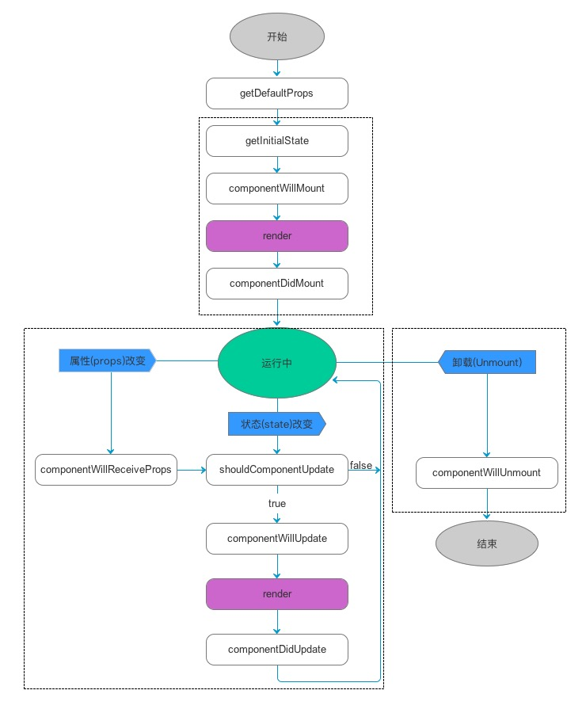

# React学习笔记

## 安装

### 脚手架安装

在全局下安装脚手架，创建一个react项目工程

- $ npm install create-react-app -g
- $ create-react-app <project-name>

进入目录，启动项目

- cd <project-name>
- npm start

### 目录

安装完毕，目录如下


#### public

> 存放的是当前项目的HTML页面（单页面应用放一个index.html即可，多页面根据自己需求放置需要的页面）

在react中，所有的逻辑都是在JS中完成的（包括页面解构的创建），如果想给当前的页面带入一些CSS样式或者IMG图片等内容，我们有两种方式：

- 在JS中基于ES6 Module模块规范，使用import导入，这样webpack在编译合并JS的时候，会把导入的资源文件等插入到页面的结构中(**绝对不能**在JS管控的结构中通过相对目录./或者../，导入资源，因为在webpack编译的时候，地址就不在是之前的相对地址了)
- 如果不想在JS中导入（JS中导入的资源最后都会基于webpack编译），我们也可以把资源手动的在HTML中导入，但是HTML最后也要基于webpack编译，导入的地址也**不建议**写相对地址，而是使用`%PUBLIC_URL%`写成绝对地址`<link rel="manifest" href="%PUBLIC_URL%/manifest.json"> `

#### src

> 项目结构中最主要的目录，因为后期所有的JS、路由、组件等都是放到这里（包括需要编写的CSS或者图片等）

- index.js是当前项目的入口文件

#### .gitignore

> git提交时候的忽略提交文件配置项

用webStorm可以忽略提交这个

```
# webStorm
.idea
```

#### package.json

> 当前项目的配置清单

- npm run start/yarn start： 开发环境下，基于webpack编译处理，最后可以预览当前开发的项目成果（在webpack中安装了dev-server插件，基于这个插件会自动创建一个web服务[端口号默认是3000]，webpack会帮我们自动打开浏览器，展示我们的页面，并且能够监听我们的代码改变，如果代码改变了，webpack会自动重新编译，并且刷新浏览器来完成重新渲染）
- npm run build：项目需要部署到服务器上，我们先执行npm run build，把项目整体编译打包（完成后会在项目中生成一个build文件夹，这个文件夹包含了所有编译后的内容，我们把它上传到服务器，可以说是生成环境）而且在服务上进行部署的时候不需要再安装任何模块
- eject：create-react-app脚手架为了让解构目录清晰，把安装的webpack及配置文件都集成在了react-scripts模块中，放到了node_modules中。

但是真实项目中，我们需要在脚手架默认安装的基础上，额外安装一些我们需要的模块，例如：react-router-dom/axios...再比如:less/less-loader

1. 情况一：如果我们安装其他的组件，但是安装成功后不需要修改webpack的配置项，此时我们直接的安装，并且调取使用即可。

2. 情况二：我们安装的插件是基于webpack处理的，也就是需要安装的模块配置到webpack中（重新修改webpack配置项了）

   首先需要把隐藏到node_modules中的配置项暴露到项目中，再去修改对应的配置项即可

   > $ npm run ejecct
   >
   > 会提示确认是否执行eject操作，这个操作是不可逆转的，一旦暴露出来的配置，就无法在隐藏回去了
   >
   > 如果当前的项目基于git管理，在执行eject的是偶，如果还有没有提交到历史区的内容，需要先提交到历史区，然后再eject才可以，否则报错This git repository has untracked files or uncommitted changes..

   一旦暴露后，项目目录多了两个文件夹：

   #### config:存放的是webpack的配置文件

   - webpack.config.dev.js 开发环境下的配置项(yarn start)
   - webpack.config.prod.js 生产环境下的配置项(yarn build)

   #### scripts:存放的是可执行脚本的JS文件

   - start.js  yarn start执行的就是这个JS
   - build.js  yarun build执行的就是这个JS

   package.json的内容也改了

   我们预览项目的时候，也是先基于webpack编译，把编译后的内容放到浏览器中运行，说一如果项目中使用了less，我们需要修改webpack配置项，在配置项中加入less的编译工作这样后期预览项目，首先基于webpack把less编译为css，然后呈现在页面中

   $ yarn add less less-loader 

   less是开发（看 webpack.config.dev.js）和生产环境（上线 webpack.config.prod.js）下都需要配置的

   $ set HTTPS=true&&npm start 开启HTTPS协议模式（设置环境变量HTTPS的值）

基于脚手架生成工程目录，默认会自动安装react/react-dom/react-scripts，React由两部分组成,分别是：

- react.js 是 React 的核心库
- react-dom.js 是提供与DOM相关的功能,会在window下增加ReactDOM属性,内部比较重要的方法是render,将react元素或者react组件插入到页面中。
- react-scripts集成了webpack需要的内容
  - babel一套
  - css处理一套
  - eslint一套
  - webpack一套
  - 其他的 
  - 没有less/sass东西的处理（项目中如果使用，需要自己额外的安装）

## react&react-dom

#### 渐进式框架

一种最流行的框架设计思想，一般框架中包含很多内容，这样导致框架的体积过于臃肿，拖慢加载的速度。真实项目中，我们使用一个框架，不一定用到所有的功能，此时我们应该把框架的功能进行拆分，用户想什么，让其自己自由组合即可。

#### 全家桶

即渐进式框架N多部分的组合

vue全家桶：vue-cli+vue+vue-router+vuex+axios(fetch)+vue element(vant)

react全家桶:create-react-app+react+react-dom+react-router+redux+react-redux+axios+ant+dva+saga+mobx

#### 1.react

react框架的核心部分，提供了Compoent类可以供我们进行组件开发，提供了钩子函数（生命周期函数：所有的生命周期函数，都是基于回调函数完成的）

#### 2.react-dom

把JSX语法(REACT独有的语法)渲染为真实DOM(能够放到页面中展示的结构都叫做真实DOM)的组件

##### ReactDOM.render

ReactDOM.render([JSX],[CONTAINER],[CALLBACK]):把JSX元素渲染到页面中

- JSX:REACT虚拟元素
- CONTAINER:容器，我们想把元素放到页面中的哪个容器
- CALLBACK:当把内容放到页面中呈现触发的回调函数（能触发这个函数说明元素已经放在页面中了

##### JSX

REACT独有的语法，JAVASCRIPT+XML(HTML)

和我们之前自己拼接的HTML字符串类似，都是把HTML结构代码和JS代码或者数据混合在一起了，但是它不是字符串

1. 不建议我们把JSX直接渲染到BODY中，而是放在自己创建的一个容器中，一般我们都放在一个ID位ROOT的DIV即可
2. 在JSX中出现的{}是存放JS的，但是要求JS代码执行完成需要有返回结果（JS表达式）
   - 不能直接放一个对象数据类型的值（对象（除了给style赋值）、数组（数组中如果没有对象，都是基本值或者JSX元素，这样是可以的）、函数都不行）
   - 可以是基本类型的值（布尔类型什么都不显示、null和undefined也是JSX元素，代表是空）
   - 循环判断的语句都不支持，但是支持三元运算符
3. 循环数组创建JSX元素（一般都是基于数组的MAP方法完成迭代），需要给创建的元素设置唯一的KEY值（当前本次循环内唯一即可）
4. 只能出现一个根元素
5. 给元素设置样式类用的是className而不是class
6. style中不能直接的写样式字符串，需要基于一个样式对象来遍历赋值

## 把JSX（虚拟DOM）变为真实DOM

JSX渲染机制

```react
import React from 'react';
// React.creatElement
import ReactDOM,{render} from 'react-dom'; //从react-dom中导入一个ReactDOM，逗号后面的内容是吧ReactDOM这个对象进行结构 import {render} from 'react-dom'

let styleObj = { background: 'red' }
ReactDOM.render(<h1 id='titleBox' className='title' style={styleObj}>曾洁莹</h1>,document.getElementById('root'));
```

1. 基于BABEL中的语法解析模块（BABEL-PRESET-REACT）把JSX语法编译为React-createElement(...)结构

   ```
   // 上面写的，会编译成如下结构
   React.createElement('h1',{id:'titleBox',className:'title',style:styleObj},'曾洁莹')
   ```

2. 执行React.creactElement(type,props,children)，创建一个对象（虚拟DOM）

   ```
   // 执行React.createElement，生成的对象里有
   type：'h1'
   props:{
       id:'titleBox',
       className:'title',
       style:...,
       children:'曾洁莹' =>存放的事元素中的内容
   }
   ref:null
   key:null
   ...
   _proto_:Object.prototype
   ```

3. ReactDOM.render(JSX语法最后生成的对象，容器)，基于Render方法把生成的对象动态创建为DOM元素，插入到指定的容器中

### 简单原理

```react
// 1.创建一个对象（默认有四个属性：TYPE/PROPS/REF/KEY），最后要把这个对象返回
// 2.根据传递的值修改这个对象
// TYPE=>传递的TYPE
// PROPS 需要做一些处理：大部分传递PROPS中的属性都赋值给对象的PROPS，有一些比较特殊 
//     ->如果是REF或者KEY，我们需要把传递的PROPS中的这两个属性值，给创建对象的两个属性，而传递的PROPS中把这两个值删除掉
//     ->把传递的CHILDREN作为新创建对象的PROPS中的一个属性	
// 
function createElement(type,props,children){
    props=pros||{}；
    // 创建一个对象，设置一些默认属性值
    let obj={
        type:null,
        props:{
            children:''
        },
        ref:null,
        key:null
    };
    // 用传递的TYPE和PROPS覆盖原有的默认值
	// 简单写法 obj={...obj,type,props}; //=>{type:type,props:props}
    obj={...obj,type,props:{...props,children}}
	// 把ref和key提取出来，并且删除props中的属性
	'key' in obj.props?(obj.key=obj.props.key,obj.props.key=undefined):null;
    'ref' in obj.props?(obj.ref=obj.props.ref,obj.props.ref=undefined):null;
    return obj
}
let objJSX=createElement('h1',{id:'titleBox',className:'title',style:{color:'red'}},'曾洁莹')

// render:把创建的对象生成对应的DOM元素，最后插入到页面中
function render(obj,container,callBack){
    let {type,props}=obj||{},
        newElement=document.createElement(type);
    for(let attr in props){
        if(!props.hasOwnProperty(attr)) break; // 不是私有的，说明找到原型上的，直接结束遍历
        if(!props[attr]) continue; // 如果当前属性没有值，直接不处理即可
        let value=props[attr];
        // CLASS-NAME的处理
        if(attr==='className'){
            newElement.setAttribute('class',value);
            continue
        }
        // STYLE处理
        if(attr==='style'){
            // 如果是空字符串不处理
            if(value==='') continue;
            for(let styKey in value){
                if(value.hasOwnProperty(styKey)){
                    newElement['style'][styEle]=value[styKey]
                }
            }
            continue;
        }
        // CHILDREN处理
        if(attr==='children'){
            if(typeof value=='string'){
                let text=document.createTextNode(value);// 创建文本节点
                newElement.appendChild(text);
            }
            continue;
        }
        newElement.setAttribute(attr,value); // 基于SET-ATTRIBUTE可以让设置的属性表现在HTML的结构上
    }
    container.appendChild(newElement);
    callBack&&callBack();
}
render（objJSX,root,()=>{
    console.log('ok')
})
```

进一步优化：含有多标签

```react
// 创建JSX对象
//   参数：至少两个 type/pros,children这个部分可能没有，也可能有多个
//   
function(type,props,...childrens){// 剩下的参数都是childrens数组里
    let ref,key;
    if('ref' in props){}
    if('key' in props){}
    return{
        type,
        props:{
            ...props,
            children:childrens.length<=1?(childrens[0]||''):childrens
        },
        ref,
        key
    }
}


function createElement(type,props,children){ 
    props=pros||{}；
    // 创建一个对象，设置一些默认属性值
    let obj={
        type:null,
        props:{
            children:''
        },
        ref:null,
        key:null
    };
    // 用传递的TYPE和PROPS覆盖原有的默认值
	// 简单写法 obj={...obj,type,props}; //=>{type:type,props:props}
    obj={...obj,type,props:{...props,children}}
	// 把ref和key提取出来，并且删除props中的属性
	'key' in obj.props?(obj.key=obj.props.key,obj.props.key=undefined):null;
    'ref' in obj.props?(obj.ref=obj.props.ref,obj.props.ref=undefined):null;
    return obj
}
let objJSX=createElement('h1',{id:'titleBox',className:'title',style:{color:'red'}},'曾洁莹')

// render:把创建的对象生成对应的DOM元素，最后插入到页面中
function render(obj,container,callBack){
    let {type,props}=obj||{},
        newElement=document.createElement(type);
    for(let attr in props){
        if(!props.hasOwnProperty(attr)) break; // 不是私有的，说明找到原型上的，直接结束遍历
        if(!props[attr]) continue; // 如果当前属性没有值，直接不处理即可
        let value=props[attr];
        // CLASS-NAME的处理
        if(attr==='className'){
            newElement.setAttribute('class',value);
            continue
        }
        // STYLE处理
        if(attr==='style'){
            // 如果是空字符串不处理
            if(value==='') continue;
            for(let styKey in value){
                if(value.hasOwnProperty(styKey)){
                    newElement['style'][styEle]=value[styKey]
                }
            }
            continue;
        }
        // CHILDREN处理
        // 可能是一个值：可能是字符串也能是一个JSX对象
        // 可能是一个数组：数组中的每一项可能是字符串也可能是JSX对象
        
        // 首先把一个值也变为数组，这样后期统一操作数组即可
        if(attr==='children'){
            if(!(value instanceof Array)){
                value=[value]
            }
            value.forEach((item,index)=>{
                // 验证item是什么类型的：如果是字符串就是创建文本节点。如果是对象，我们需要再次执行render方法，把创建的元素放到最开始创建的大盒子中
                if(typeof value=='string'){
                    let text=document.createTextNode(item);// 创建文本节点
                    newElement.appendChild(text);
                }else{
                    render(item,newElement);
                }
            })
            else{
                // 如果只有一个值，我们创建一个文本节点即可
                 if(typeof value=='string'){
                    let text=document.createTextNode(value);// 创建文本节点
                    newElement.appendChild(text);
                }               
            }

            continue;
        }
        newElement.setAttribute(attr,value); // 基于SET-ATTRIBUTE可以让设置的属性表现在HTML的结构上
    }
    container.appendChild(newElement);
    callBack&&callBack();
}
render（objJSX,root,()=>{
    console.log('ok')
})
```

## 组件

### 1、react组件

不管是vue还是react框架，设计之初都是期望我们按照“组件/模块管理”的方式来构建程序，也就是把一个程序划分为一个个的组件来单独处理

**优势**

1. 有助于多人协作开发
2. 我们开发的组件可以被复用
3. ...

react中创建组件有两种方式：

#### 函数声明式组件

基于集成COMPONENT类来创建组件

src->component:一般会在src里面建一个component文件夹，这个文件夹存放的就是开发的组件

##### src->index.js

```react
import React from 'react'
import ReactDOM from 'react-dom';
import Dialog from './component/Dialog'

ReactDOM.render(<div>
     {/* 注释：JSX调取组件，只需要把组件当作一个标签使用即可（单双闭合都可以） */}
	<Dialog con="哈哈"/>
       {/* 属性值不是字符串，我们需要大括号包起来 */} 
      <Dialog con"嘿嘿" lx={1}>
      	<span>1</span>    
        <span>2</span> 
      <Dialog/>  
</div>,root)
```

##### src->component->Dialog.js

```react
// 每一个组件中都要导入REACT，因为需要基于它的CREAT-ELEMENT把JSX解析渲染
import React from 'reacr'；

//函数声明组件
// 1、函数返回结果，是一个新的JSX（也就是当前组件的JSX结构）
// 2、props变量存储的值是一个对象，包含了调取组件时候传递的属性值（不传递是一个空对象）
export default function Dialog(props){
    let {con,lx=0,children,style}=props,
        title=lx===0?'系统提示':'系统警告'
    
    // children:可能有可能没有，可能只是一个值，也可能是一个数组，可能每一项是一个字符串，也可能是一个对象等（都代表双闭合组件中的子元素）
    return <session style={style}>
    	<h2>{title}</h2>
        <div>{con}</div>
        { /* 把属性中传递的子元素放到组件中的指定位置 */}       
        {children}
        { /* 也可以基于REACT中提供的专门遍历CHILDREN的方法来遍历操作
        */}  
        {Reacr.Children.map(children,item=>itm)}
    </session>
}
```

#### 函数式组件的渲染机制

知识点：CREATE-ELEMENT在处理的时候，遇到一个组件，返回的对象中，TYPE就不再是字符串标签名了，而是一个函数（类），但是属性还是存在PROPS中

```
{
    type:Dialog,
    props:{
        lx:1,
        con:'xxx',
        children:一个值或者一个数组
    }
}
```

render渲染的时候，我们需要做处理，首先判断TYPE类型，如果是字符串，就创建一个元素标签，如果函数或者类，就把函数执行，把PROPS中的每一项（包含CHILDREN）传递给函数

在执行函数的时候，把函数中的RETURN的JSX转换为新的对象（通过CREATE-ELEMENT），把这个函数返回。紧接着RENDER按照以往的渲染方式，创建DOM元素，插入到制定的容器中即可


## JSX

jsx语法是facebook自己发明的，是javascript和xml语法的集合体，即可以像平常一样使用HTML，也可以在里面嵌套JavaScript语法。将组件的结构、数据甚至样式都聚合在一起定义组件，运行时，Babel等工具会将JSX编译成JavaScript语法。

```jsx
let ele = (
    <h1 className="red">
        hello!
        <span>ReneeTsang!</span>
    </h1>
);
```

### ReactDOM.render()

ReactDOM.render 是 React 的最基本方法，用于将模板转为 HTML 语言，并插入指定的 DOM 节点。

JSX其实只是一种语法糖，最终会通过[babel](https://babeljs.io/repl/)转译成createElement语法，以下代码等价

```javascript
ReactDOM.render(ele);
ReactDOM.render(React.createElement("h1",{className: "red" },"hello!",React.createElement("span",null,"ReneeTsang!")));
```

### JSX表达式的用法

jsx和html的写法不完全一样。

- 遇到 HTML 标签（以 `<` 开头），就用 HTML 规则解析；遇到代码块（以 `{` 开头），就用 JavaScript 规则解析


- 如果换行需要用`()`包裹jsx代码
- 复数同级标签，必须加一层标签包裹，如不想使用div等包裹，可以使用`<React.Fragment>`


- 可以放JS的执行结果，用`{}`包裹
- 可以把JSX元素当作函数的返回值

```jsx
import React from 'react';
// React.creatElement
import ReactDOM from 'react-dom';

let sty = { background: 'red' }
let ele = (
    <React.Fragment>
        <h1style={{background: 'red'}}>{/*可以这样子写注释*/} title</h1>
        <h1 style={sty}>hello</h1>
    </React.Fragment>
)

function toResult({name,age}) {
    return <span>今年{name},{age}岁了!</span>
}
let arrs =  [{name:'renee',age:18},{name:'洁莹',age:18}];
ReactDOM.render(<div>
    {arrs.map(((item,index)=>(
        typeof item==='object'?<li key={index}>{toResult(item)}</li>:null
    )))}
</div>,document.getElementById('root'));
```

- JSX 允许直接在模板插入 JavaScript 变量。如果变量是数组，数组可以直接渲染到页面上。

```jsx
let dinner = ['汉堡', '可乐', '薯条'];
// 渲染列表要用map
let eleObj = dinner.map((item, index) => (
    <li key={index}>{item}</li>
));
render(eleObj, window.root);
```

### JSX属性

- 在JSX中分为普通属性和特殊属性，像class要写成className，for要写成htmlFor，因为class和for是js关键字

```jsx
let ele = (
    <label htmlFor="a" className="focus">输入焦点</label>
    <input type="text" id="a"/>
)
```

- style属性要采用对象的形式来写
- key 使用驼峰写法，value值是字符串

```jsx
let sty = { background: 'red',color: 'blue'}
let ele = (
    <h1 style={sty}>hello</h1>
)
```

- 使用dangerouslyInnerHTML属性插入html，但会导致xss攻击

```jsx
let ele = (
	<div dangerouslySetInnerHTML={{__html:'<h1>hello world</h1>'}}></div>
)
```

### JSX组件

react元素是是组件组成的基本单位，组件名需要**开头大写**，react组件当作jsx来进行使用

- 首字母必须大写，目的是为了和JSX元素进行区分
- 组件也是JSX元素，定义后可以像JSX元素一样进行使用
- 每个组件必须返回唯一的顶级JSX标签元素，也可以返回null，null也是合法的
- 可以通过render方法将组件渲染成真实DOM，但是只会渲染一次
- render方法重复渲染只会局部更新

#### 组件分为两种 ，函数组件(函数)function和类组件class

- 第一种方式是函数声明
  - 函数组件中**没有**自己的状态、this和生命周期

```jsx
function Build(props) {
  return <p>{props.name} {props.age}</p>
}
render(<div>
  <Build name={school1.name} age={school1.age}/>
  <Build {...school2} />
</div>,window.root);
```

- 第二种方式是类声明，类声明**有**状态，this，和生命周期，所以这个用的多

  - 类组件，需要有自己的状态，需要继承父类组件extends Component
  - 如果用类组件需要提供一个render方法，必须要返回一个 JSX 元素，会自动将render方法的返回值作为结果进行渲染


```jsx
import React, { Component } from 'react';
import ReactDOM,{ render } from 'react-dom';

//我们的组件要继承React组件，因为react组件封装了很多方法，如this.setState()
class Build extends Component{
    constructor(props){
        
    }  
  render(){
      let {name,age} = this.props;
      return <p>{name} {age}</p>
  }
}
render(<Bulid name='renee'></Bulid>,window.root)
```

#### 组件中属性和状态的区别

- 组件的数据来源有两个地方
  - props 外界传递过来的(默认属性，属性校验)，在render方法中可以通过this.props获取属性
  - React.js 也提供了一种方式 `defaultProps`，可以方便的做到默认配置。 
  - `props` 一旦传入进来就不能改变 
  - state 状态是自己的,改变状态唯一的方式就是setState
  - setState是批量更新的，不一定是同步的

> 属性和状态的变化都会影响视图更新

```jsx
import React, { Component } from 'react';
import ReactDOM,{ render } from 'react-dom';

class Clock extends Component{
    constructor(){
        super();
        this.state = {date:new Date().toLocaleString(),name:'zfpx'}
    }
    // 如果用类组件需要提供一个render方法
    // 组件渲染完成后会调用这个生命周期
    // 什么时候放在this上 什么时候放在this.state上
    componentDidMount(){ // 组件渲染完成，当渲染后会自动触发此函数
        this.timer = setInterval(()=>{
            // setState可以更新页面
            // 会将这个对象和原有的状态进行合并，合并后重新渲染页面
            this.setState({ date: new Date().toLocaleString() });
        },1000)
    }
    componentWillUnmount(){ // 组件将要卸载，当组件移除时会调用
        clearInterval(this.timer); // 一般卸载组件后要移除定时器 和绑定的方法
    }
    // 绑定方法有几种方式 方法中可能会用this
    // 1.箭头函数
    // 2.bind
    // 3.再构造函数中绑定this  this.handleClick = this.handleClick.bind(this)
    // 4.es7语法 可以解决this指向
    handleClick=()=>{
        ReactDOM.unmountComponentAtNode(document.querySelector('#root'));
    }
    render(){
        return (
            <div onClick={this.handleClick}>
                时间是:{this.state.date} 名字:{this.state.name}
            </div>
        )
    }
}
render(<div>
    <Clock /> 
</div>, window.root);

// 组件有两个数据源 一个是属性 外界传递的  还有一个叫状态是自己的
// 你传递的属性可能不是我预期的
```

#### PropTypes属性校验

> npm install prop-types

组件的属性可以接受任意值，字符串、对象、函数等等都可以。有时，我们需要一种机制，验证别人使用组件时，提供的参数是否符合要求。

propTypes和defaultProps名字不能更改，这是react规定好的名称

```jsx
import React from 'react';
import ReactDOM from 'react-dom';
import PropTypes from 'prop-types'; //引入属性校验的模块
class School extends React.Component{ // 类上的属性就叫静态属性
    // ES7方法，ES6不支持静态属性，只有静态方法
    // 校验属性类型
    static propTypes = { // 校验属性的类型和是否必填
        name: PropTypes.string.isRequired,// 支持的类型可以参考prop-types的readme文件
        age:PropTypes.number.isRequired,
        gender: PropTypes.oneOf(['male','famale'])
    };
	// 默认属性值
    static defaultProps = { // 先默认调用defaultProps
        name:'renee', // 没传就用renee
        age:18,
        gender:'女'
    }; // 默认属性
    constructor(props){ //如果想在构造函数中拿到属性需要通过参数的方式
         //不能在组件中更改属性
        super();
    }
    render(){
        return <h1>{this.props.name} {this.props.age} {this.props.gender}</h1>
    }
}
```

#### 绑定事件

给元素绑定事件，事件绑定方式

- React.js 中的`event` 对象并不是浏览器提供的，而是它自己内部所构建的。

- 给jsx元素绑定事件要注意事件中的this指向，事件名采用 on+"开头大写事件名"的方式

bind解决this问题，不会产生新的函数，只执行一次。但一般还是用ES7箭头函数

```react
class Clock extends Component {
    constructor(){
        super();
        this.state = {num:0};
        this.fn=this.fn.bind(this)
    }
    fn(){
        console.log(this)
    }
    render(){
        return <h1 onClick={this.fn}>{this.state.date}</h1>
    }
}
ReactDOM.render(<Clock/>,window.root);
```

```react
class Clock extends Component {
    constructor(){
        super();
        this.state = {num:0};
    }
    fn=()=>{(
        // 发现this.state都是同一个，都一样，这样写只会执行一个
        // this.setState({num:this.state.num+1})
        // this.setState({num:this.state.num+1})
        // this.setState({num:this.state.num+1})   
        
        // 想获取更改后的值，再累加，这种方式不建议
        this.state({num:this.state.num+1},()=>{
            this.state({num:this.state.num+1})
        })
        // 可以这么写
        // 会把上一个 setState 的结果传入这个函数，你就可以使用该结果进行运算、操作，然后返回一个对象作为更新 state 的对象
        this.setState((prevState)=>({num:prevState.num+1}));        		    this.setState((prevState)=>({num:prevState.num+1}));
    )}
    render(){
        return (<div>
        	{this.state.num}
             <button onClick={this.fn}>+</button>   
             <button onClick={this.remove}>删除组件</button>   
        </div>)
    }
}
ReactDOM.render(<Clock/>,window.root);
```

```jsx
class Clock extends Component {
    constructor(){
        super();
        this.state = {date:new Date().toLocaleString()}
    }
    componentDidMount(){ //组件渲染完成，当渲染后会自动触发此函数
        this.timer = setInterval(()=>{ // 箭头函数 否则this 指向的是window
            this.setState({date:new Date().toLocaleString()})
        },1000);
    }
    componentWillUnmount(){ //组件将要卸载，当组件移除时会调用
        clearInterval(this.timer); //一般在这个方法中 清除定时器和绑定的事件
    }
    destroy=()=>{ //es7 箭头函数
        // 删除某个组件
        ReactDOM.unmountComponentAtNode(window.root);
    }
    render(){
        // 给react元素绑定事件默认this是undefined,可以用bind方式（会产生新函数）、箭头函数
        return <h1 onClick={this.destroy}>{this.state.date}</h1>
    }
}
// 执行顺序 constructor -> render -> componentDidMount -> setState-> render - onClick-> unmountComponentAtNode -> componentWillUnmount -> clearInterval
ReactDOM.render(<Clock/>,window.root);
```

#### 组件的通信方式

组件间的通信，第一种方法就是通过属性传递，父->子->孙子

是单向数据流，数据方向是单向的，儿子不能更改父亲的属性


#### 受控组件和非受控组件

受控组件和非受控组件（state），指的都是表单元素

- 受控组件，可以对输入进行监控，而且对表单进行默认值操作

- 非受控组件
  - 可以操作dom，获取真实dom
  - 可以和第三方库结合，如JQ
  - 不需要对当前输入的内容进行校验，也不需要默认值

##### 受控组件

> React.js 认为所有的状态都应该由 React.js 的 state 控制，只要类似于 `<input />`、`<textarea />`、`<select />` 这样的输入控件被设置了 `value`值，那么它们的值永远以被设置的值为准。值不变，`value` 就不会变化。 
>
> 在 React.js 当中必须要用 `setState` 才能更新组件的内容，所以我们需要做的就是：监听输入框的`onChange` 事件，然后获取到用户输入的内容，再通过 `setState` 的方式更新 `state`中的 `username`，这样 `input` 的内容才会更新。 

```javascript
{/* 写了value 要写onChange事件更改状态或者用defaltValue，不然不会更改 */}
<input type="text" required={true} value={this.state.a} onChange={this.handleChange} name="a"/>
```

##### 非受控组件


###  生命周期lifeCycle



#### componentWillMount 组件挂载之前

在组件挂载之前调用且全局只调用一次。如果在这个钩子里可以setState，render后可以看到更新后的state，不会触发重复渲染。该生命周期可以发起异步请求，并setState。（*React v16.3后废弃该生命周期，没什么用处，如果想要在render之前调取某些属性，可以在constructor中完成设置state*）

#### componentDidMount 组件挂在完成后

#### shouldComponentUpdate

#### componentDidUpdate

```react

```


