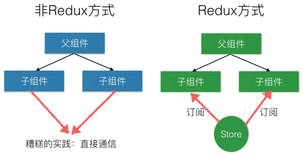
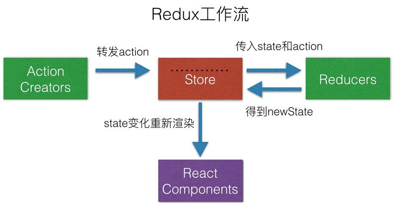

# Redux

Redux 是一个 JavaScript 应用状态管理的库，当项目很复杂的时候，属性传递已经达不到我们预期，可以使用Redux 解决数据传递问题，统一状态管理。换句话说，Redux就是用来处理和管理应用的状态/数据。



##　Redux设计思想

- Redux是将整个应用状态存储到到一个地方，称为store
- 里面保存一棵状态树(state tree)
- 组件可以派发(dispatch)行为(action)给store,而不是直接通知其它组件
- 其它组件可以通过订阅store中的状态(state)来刷新自己的视图



## 实现简单的Redux

来写一个简单的"redux"吧！

实现把内容渲染到页面上

### 1.渲染状态

```jsx
//数据源
let appState={
    title: {color: 'red',text: '标题'},
    content:{color:'green',text:'内容'}
}
// 渲染标题
function renderTitle(title) {
    let titleEle=document.querySelector('#title');
    titleEle.innerHTML=title.text;
    titleEle.style.color=title.color;
}
// 渲染内容
function renderContent(content) {
    let contentEle=document.querySelector('#content');
    contentEle.innerHTML=content.text;
    contentEle.style.color=content.color;
}
// 执行渲染的方法
function render(appState) {
    renderTitle(appState.title);
    renderContent(appState.content);
}
render(appState);
```

### 2.提高数据修改的门槛

- 状态不应该是全局的，也不应该哪个方法里直接可以更改（操作危险）
- 一旦数据可以任意修改，所有对共享状态的操作都是不可预料的
- 模块之间需要共享数据和数据可能被任意修改导致不可预料的结果之间有矛盾
- 所以提供一个修改状态的`dispatch`方法，不要去直接更改状态，对数据的操作修改必须通过这个方法

```jsx
let appState={
    title: {color: 'red',text: '标题'},
    content:{color:'green',text:'内容'}
}
function renderTitle(title) {
    let titleEle=document.querySelector('#title');
    titleEle.innerHTML=title.text;
    titleEle.style.color=title.color;
}
function renderContent(content) {
    let contentEle=document.querySelector('#content');
    contentEle.innerHTML=content.text;
    contentEle.style.color=content.color;
}
function render(appState) {
    renderTitle(appState.title);
    renderContent(appState.content);
}
//先定义好要做那些事情（常量） 也叫宏
const UPDATE_TITLE_COLOR = 'UPDATE_TITLE_COLOR';
const UPDATE_CONTENT_CONTENT = 'UPDATE_CONTENT_CONTENT';

// 派发的方法，用来更改状态
// 派发时应该将修改的动作action提交过来，是个对象，对象里的type属性是固定必须的。
function dispatch(action) {
    switch (action.type) {
        case UPDATE_TITLE_COLOR:
            appState.title.color=action.color;    
            break;    
        case UPDATE_CONTENT_CONTENT:
            appState.content.text=action.text;
            break;
        default:
            break;    
    }
}
// action是一个动作，是个对象{type:UPDATE_TITLE_COLOR,color:'purple'}
dispatch({type:UPDATE_TITLE_COLOR,color:'purple'});
dispatch({type:UPDATE_CONTENT_CONTENT,text:'新标题'});

render(appState);
```

### 3.分装仓库

把状态放进一个容器里，保护起来，将定义状态和规则的部分抽离到容器外面

```jsx
function renderTitle(title) {
    let titleEle=document.querySelector('#title');
    titleEle.innerHTML=title.text;
    titleEle.style.color=title.color;
}
function renderContent(content) {
    let contentEle=document.querySelector('#content');
    contentEle.innerHTML=content.text;
    contentEle.style.color=content.color;
}
function render(appState) {
    renderTitle(appState.title);
    renderContent(appState.content);
}
// 创建容器/仓库
function createStore(reducer) {
    let state;
    // 让外面可以获取状态
    function getState() {
        return state;
    }

    function dispatch(action) { 
        state=reducer(state,action); // 把新状态覆盖
    }
    // 在创建仓库的时候派发一次动作，为了走下reducer获取初始值，写个空对象是undefined走默认值
    dispatch({});
    
    // 将方法暴露给外面使用,将状态放到了容器中外部无法在进行更改了
    return { getState , dispatch }
}

// 容器一般会封装成库
// 将定义状态和规则的部分抽离到容器外面，再传进去
// 初始状态
let initState={
    title: {color: 'red',text: '标题'},
    content:{color:'green',text:'内容'}
}
const UPDATE_TITLE_COLOR = 'UPDATE_TITLE_COLOR';
const UPDATE_CONTENT_CONTENT = 'UPDATE_CONTENT_CONTENT';

// 用户自己定义的规则，我们叫它reducer，也就是所谓的管理员
// 处理器 reducer要有两个参数，传入老的状态和新传递的动作算出新的状态
// 如果想获取默认状态，有一种方式，就是调用reducer，让每一个规则都不匹配将默认值返回
// 在reducer中，reducer是一个纯函数，每次需要返回一个新的状态，只承担计算 State 的功能
let reducer=function (state=initState,action) {
    switch (action.type) {
        case UPDATE_TITLE_COLOR:
            return {...state,title: {...state.title,color:action.color}};
        case UPDATE_CONTENT_CONTENT:
        return {...state,content: {...state.content,text:action.text}};    
            break;
        default:
            return state;    
    }
}

let store=createStore(reducer);
render(store.getState());
setTimeout(function () {
    store.dispatch({type:UPDATE_TITLE_COLOR,color:'purple'});
    store.dispatch({type:UPDATE_CONTENT_CONTENT,text:'新标题'});
    render(store.getState());
},2000);
```

### 4.监控数据变化 发布订阅

```jsx
function renderTitle(title) {
    let titleEle=document.querySelector('#title');
    titleEle.innerHTML=title.text;
    titleEle.style.color=title.color;
}
function renderContent(content) {
    let contentEle=document.querySelector('#content');
    contentEle.innerHTML=content.text;
    contentEle.style.color=content.color;
}
function render() {
    renderTitle(store.getState().title);
    renderContent(store.getState().content);
}
function createStore(reducer) {
    let state;
    let listeners=[]; // 订阅者
    function getState() {
        return state;
    }
	// 发布订阅模式，先将render方法订阅好，每次dispatch时都调用订阅好的方法
    function dispatch(action) { // 发布
        state=reducer(state,action);
        listeners.forEach(l=>l()); // 当状态变化时执行
    }

    function subscribe(listener) { // 订阅的方法
        listeners.push(listener);
        return () => {
            // 再次调用时 移除监听函数
            listeners = listeners.filter(item => item!=listener);
            console.log(listeners);
        }
    }
    dispatch({});
    return { getState,dispatch,subscribe }
}
let initState={
    title: {color: 'red',text: '标题'},
    content:{color:'green',text:'内容'}
}
let reducer=function (state=initState,action) {
    switch (action.type) {
        case UPDATE_TITLE_COLOR:
            return {...state,title: {...state.title,color:action.color}};
        case UPDATE_CONTENT_CONTENT:
        return {...state,content: {...state.content,text:action.text}};    
            break;
        default:
            return state;    
    }
}
let store=createStore(reducer);
render();
let unsubscribe = store.subscribe(render);
setTimeout(function () {
    store.dispatch({type:'UPDATE_TITLE_COLOR',color:'purple'});
    unsubscribe();
    store.dispatch({type:'UPDATE_CONTENT_CONTENT',text:'新标题'});
},2000);
```

## Redux概念解析


### Store

Redux的核心是一个`store` ，就是保存数据的地方，可以看出是一个容器，整个应用就只能有一个store。Redux提供`createStore()`函数来生成store。

```javascript
import { createStore } from 'redux';
let store = createStore(fn);
```

上面代码中，createStore函数接受另一个函数作为参数，返回新生成的Store对象。

### State

store 某个节点对应的数据集合就是state。`state` 是被托管的数据，也就是每次触发监听事件，我们要操作的数据。可以通过`store.getState()`获得。

Redux 规定，一个state对应一个View。State相同，则View相同。

```jsx
let store = createStore(fn);
let state = store.getState();
```

### Action

State 的变化，会导致 View 的变化。但是，用户接触不到 State，只能接触到 View。所以，State 的变化必须是 View 导致的。Action 就是 View 发出的通知，表示 State 应该要发生变化了。

Action 是一个对象。其中的`type`属性是必须的，表示 Action 的名称。其他属性可以自由设置。

```javascript
{ type: types.ADD_TODO , text: '读书' }
```

### Actor Creator

action creator 顾名思义就是用来创建 action 的，action creator 只简单的返回 action。

```javascript
const ADD_TODO = 'ADD_TODO';
let actions = {
    addTodo(todo){
        return { type: ADD_TODO, todo}
    }
}
```

###　store.dispath(action)

store.dispatch()是 View 发出 Action 的唯一方法。store.dispatch接受一个 Action 对象作为参数，将它发送出去

```javascript
let store=createStore(reducer);
store.dispatch({type:'ADD_TODO',text:'读书'});
```

结合 Action Creator，这段代码可以改写如下。

```javascript
 store.dispatch(actions.addTodo(e.target.value))
```

## Redux 核心API

### createStore

使用方法

> let store=createStore(reducer);

- reducer

  在Redux中，负责响应`action`并修改数据的角色就是`reducer`。 reducer要有两个参数 ，要根据老的状态和新传递的动作算出新的状态。`reducer`本质上是一个纯函数，每次需要返回一个新的状态对象。

  纯函数很严格，也就是说你几乎除了计算数据以外什么都不能干，计算的时候还不能依赖除了函数参数以外的数据。

  ```javascript
  //以下为reducer的格式
  const todo = (state = initialState, action) => {
    switch(action.type) {
        case 'XXX':
            return //具体的业务逻辑;
        case 'XXX':
            return //具体的业务逻辑;   
        default:
            return state;
    }
  }
  ```

- getState()

  将状态放到了容器中外部无法在进行更改了，使用获取`store`中的状态。

- dispatch(action)

- subscribe(listener)

###combineReducers

合并reducer，把他们合并成一个

key是新状态的命名空间，值是reducer，执行后会返回一个新的reducer。

```javascript
let reducer = combineReducers({
    c: counter,
    t: todo
});
```

原理：

```javascript
function combineReducers(reducers) {
    // 第二次调用reducer ，内部会自动的把第一次的状态传递给reducer
    return (state = {}, action) => {
        let newState = {}
        // reducer默认要返回一个状态，要获取counter的初始值和todo的初始值
        for (let key in reducers) {
            // 默认reducer俩参数 一个叫state，一个叫action
            // 俩参数初始值是undefined, {}
            let s = reducers[key](state[key], action);
            newState[key] = s;
        }
        return newState;
    }
}
```

### context

react提供一个context API，可以解决跨组件的数据传递。16.3版本以前的context和现在最新版context用法有区别。在16.3官方不推荐使用，如果某个组件shouldComponentUpdate返回了false后面的组件就不会更新了

contextAPI 新的方法非常简便。

```jsx
import React from 'react';
import {render} from 'react-dom';
// 创建一个上下文,有两个属性 一个叫Provider提供者（传递数据） 还有个叫Consume消费者（接受消费数据），可以跨级别传递数据（父->子 孙）
// createContext中的对象是默认参数
let { Consumer,Provider} = React.createContext();
// context 可以创建多个 这时候就不要解构了，不同的context是不能交互的
class Title extends React.Component{
    render(){
        // 子类通过Consumer进行消费 内部必须是一个函数 函数的参数是Provider的value属性
        return <Consumer>
            {({s,h})=>{
                return <div style={s} onClick={()=>{
                    h('red');
                }}>hello</div>
            }}
        </Consumer>
    }
}
class Head extends React.Component{
    render() {
        return <div>
            <Title></Title>
        </div>
    }
}
//  Provider使用在父组件上
class App extends React.Component{
    constructor(){
        super();
        this.state = {color:'green'}
    }
    handleClick = (newColor) =>{
        this.setState({ color: newColor})
    }
    render(){
        return <Provider value={{ s: this.state,h:this.handleClick}}>
            <Head></Head>
        </Provider>
    }
}
render(<App></App>,window.root)
```

##　例子：简单的加减数量

```jsx
import React,{Component} from 'react';
import {createStore} from '../redux';

let initState = {number:0};
// 创建需要的方法 ation-type
const INCREMENT = 'INCREMENT';
const DECREMENT = 'DECREMENT';
// 创建规则
function reducer(state = initState,action){ //{type:'IN...',count:2}
    switch (action.type) {
        case INCREMENT:
            return { number:state.number + action.count};
        case DECREMENT:
            return { number: state.number - action.count}
    }
    return state;
}
// 创建容器
let store = createStore(reducer);
export default class Counter extends Component{
    constructor(){
        super();
        this.state = { number: store.getState().number}
    }
    componentDidMount(){
        // 组件挂载完成后 希望订阅一个更新状态的方法，只要状态发生变化，就setState更新视图
        this.unsub = store.subscribe(()=>{
            this.setState({ number: store.getState().number })
        });
    }
    componentWillUnmount(){
        // 移除订阅
        this.unsub();
    }
    render(){
        return <div>
            {/* 属性和状态变了，视图才会更新，所以要放在状态里 */}
            计数器 {this.state.number}
            <button onClick={()=>{
                store.dispatch({type:INCREMENT,count:2})
            }}>+</button>
            <button onClick={()=>{
                store.dispatch({ type: DECREMENT, count: 1 })
            }}>-</button>
        </div>
    }
}
```

## 优化结构 

`index.js`中的代码逐渐变得冗杂。我把所有的代码都写在`index.js`中是为了起步时的简单易懂。接下来，我们来看一下如何组织Redux项目。首先，在`src`文件夹中创建一下文件和文件夹：

一般项目里，会有一个store的文件夹，专门管理的redux的

- actions 里放actorCreator的
- reducers 里放reducer的
  - 一般情况下，如果用combineReducers，一般会在reducers文件夹下在新建一个单独的文件(index.js)，把合并的reducer导出来再用
- action-types.js 放常量的（想要实现的功能）
- index.js 创建容器stores

```javascript
├── components
│   └── Counter.js
├── index.js
└── store
    ├── action-types.js
    ├── actions
    │   └── counter.js
    ├── index.js
    └── reducers // 专门处理自己的动作
        └── counter.js
```

## React-Redux

Redux流程中，每个组建中要把状态映射到组建上，还要自己订阅和更新，很麻烦。所以React-Redux诞生了，可以实现把redux映射到组件里，还可以自动更新。

#### connect()

React-Redux 提供`connect`方法，是个高阶函数，用于从 UI 组件生成容器组件。connect方法调用后返回的是新组件。

其中`connect`方法接受两个参数：`mapStateToProps`和`mapDispatchToProps`

- mapStateToProps

  映射state状态到props属性上。mapStateToProps会订阅 Store，每当state更新的时候，就会自动执行，重新计算 UI 组件的参数，从而触发 UI 组件的重新渲染。

  ```javascript
  let mapStateToProps = (state)=>{ // state就是store.getState()
      return {n:state.c.number} // 相当于以前的store.getState().c.number 返回的结果会作为Counter的属性
  }
  ```

- mapDispatchToProps

  将dispatch方法的返回值作为属性对象

```jsx
import React, { Component } from 'react';
import actions from '../store/actions/counter';
import {connect} from 'react-redux';
// connect方法是个高阶函数，是实现redux和组件的连接

class Counter extends Component {
    constructor() {
        super();
    }
    render() {
        return <div>
            计数器 {this.props.n}
            <button onClick={() => {
                this.props.add(2)
            }}>+</button>
            <button onClick={() => {
              this.props.minus(1);
            }}>-</button>
        </div>
    }
}

// connect方法接受两个参数：mapStateToProps和mapDispatchToProps
// mapStateToProps映射状态到属性
// 将状态的返回值作为属性
let mapStateToProps = (state)=>{ // state就是store.getState()
    return {n:state.c.number} // 相当于以前的store.getState().c.number 返回的结果会作为Counter的属性
}
// mapDispatchToProps将dispatch方法 返回值作为属性
let mapDispatchToProps = (dispatch) =>{ // dispatch是store.dispatch
    return {
        add(n){dispatch(actions.add(n))},
        minus(n){dispatch(actions.minus(n))}
    }
}
// connect方法调用后返回的是新组件，导出连接后的新组件给外面用
export default connect(mapStateToProps,mapDispatchToProps)(Counter);
// mapDispatchToProps很像action，可以直接用
export default connect(mapStateToProps,action)(Counter);
```

#### Provider 组件

是一个组件，用来接受store，再经过他的手通过context api传递给所有的子组件

connect方法返回的是新组件容器，需要让容器组件拿到`state`对象，才能生成 UI 组件的参数。

React-Redux 提供`Provider`组件，可以让容器组件拿到`state`。

```jsx
import React from 'react';
import {render} from 'react-dom';
import Cart from  './components/cart'
import 'bootstrap/dist/css/bootstrap.css';
import {Provider} from 'react-redux';
import store from './store';
render(<Provider store={store}>
    <Cart></Cart>
</Provider>,window.root);
```

`Provider`在根组件外面包了一层，这样一来，`App`的所有子组件就默认都可以拿到`state`了。