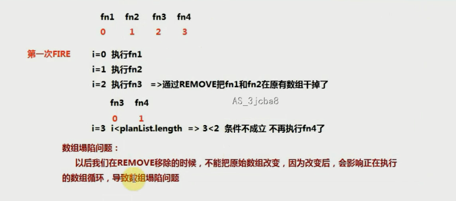
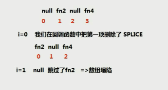

## 发布订阅模式原理和实现

> 俗称叫做“观察者模式”

> 实现思路和原理：
>
> 1、需要先创建一个计划表（容器）
>
> 2、后期需要做什么事情，我们都一次把需要处理的事情增加到计划表中
>
> 3、当符合某个条件的时候，我们只需要通知计划表中的方法按照顺序一次执行即可

#### JQ中的发布订阅

> JQ中提供了实现发布订阅设计模式的方法

```javascript
let $plan=$.Callbacks(); //创建一个计划表

let fn=function(n，m)｛
	//n=100 m=200
｝
$plan.add(fn); //向计划表中增加方法
$plan.remove(fn) //从计划表中移除方法

$plan.fire(100,200); //通知计划表中所有的方法按照顺序执行：100 200会分别作为实参传递给每一个需要执行的方法
```

#### 封装自己的发布订阅模式库

```javascript
~function(){
    //each：遍历数组每一项内容
    let each=function(ary,callBack){
        for(let i=0;i<ary.length;i++){
            let result=callBack&&callBack(ary[i],i);
            //如果执行的回调函数中返回false,代表结束当前正在遍历的操作（仿造JQ中的each语法实现的）
            if(result===false) break;
            //如果回调函数中返回的是del，代表当前这一项在回调函数中被删除了，为了防止数组塌陷问题，让索引减减
            if(result==='del') i--;
        }
    }
    
    class Plan{
        constructor(){
            this.planList=[]; //存放方法的容器
        }
        add(fn){
            let planList=this.planList,
                flag=true;
            //数组去重
            each(planList,function(item,index){
                if(item===fn){
                    flag=false;
                    return false;
                }
            })
            flag?planList.push(fn):null;
        }
        
        remove(fn){
            let planList=this.planList;
            each(planList,function(item,index){
                if(item===fn){
                    //planList.splice(index,1); 会有数组塌陷问题,详情见图
                    planList[index]=null;
                    return false;
                }
            })
        }
        
        fire(...arg){
            let planList=this.planList;
            each(planList,function(item,index){
                if(item===null){
                    //当前项是已经被remove移除掉的
                    planList.splice(index,1);
                    return 'del';
                }
                item(...arg);
            })
        }
        
        static Callbacks(){
            return new Plan();
        }
    }
    window.$=window.Plan=Plan;
}()
let plan1=Plan.Callbacks()
let fn1=function(){console.log(1,arguments)}
plan1.add(fn1);
let fn2=function(){console.log(2)}
plan1.add(fn2);
let fn3=function(){console.log(3)}
plan1.add(fn3);
let fn4=function(){console.log(4)}
plan1.add(fn4);
plan1.fire()
```



